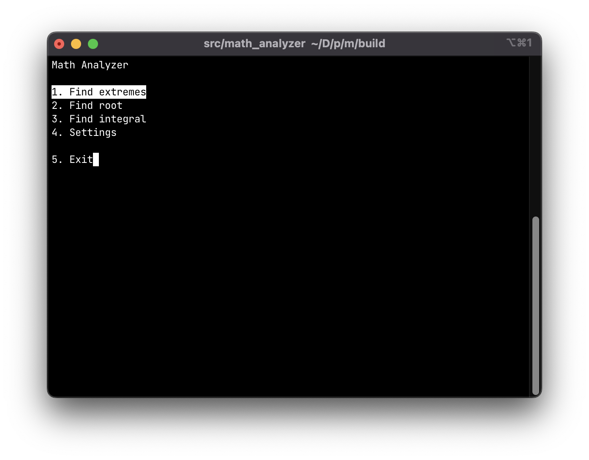
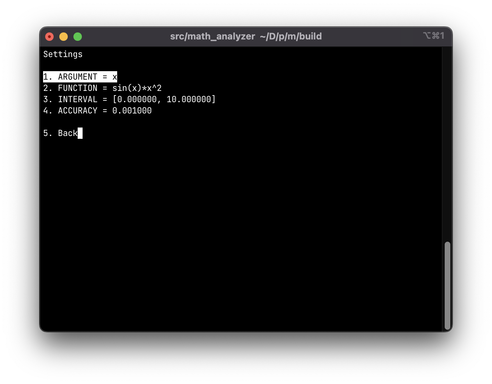

<div align="center">

# math-analyzer

practical work at the department of cs6 of bmstu

</div>

## Contents

* [Task](#task)
* [Images](#images)
* [Installation](#installation)
    * [MacOS](#macos-installation)
    * [Linux](#linux-installation)

## Task <a name="task"></a>

Perform structural decomposition, develop a block diagram containing at least
3 subroutines, and algorithms of these subroutines. Implement in C++ in console
mode. Provide a primitive menu-type interface that allows you to select
the desired subroutine.

Write a program to study the function `y=sin(x)*x^2` on a given segment
`[a,b]`. The research consists in finding the extremums of the function,
finding the root by the method of half division and finding the integral
by the method of rectangles with a given accuracy `ξ`. The user should be able
to set the interval on request, and select the type of study using the menu.

## Images <a name="images"></a>

<p float="left">
    
    
</p>

## Installation <a name="installation"></a>

### MacOS <a name="macos-installation"></a>

1. Install `ncurses` library:

```sh
brew install ncurses
```

2. Build project:

```sh
git clone git@github.com:daronenko/math-analyzer.git
cd math-analyzer/build
cmake ..
make
```

3. Run binary:

```sh
src/math-analyzer
```

### Linux <a name="linux-installation"></a>

1. Install `ncurses` library:

```sh
sudo apt update
sudo apt install libncurses-dev
```

2. Build project:

```sh
git clone git@github.com:daronenko/math-analyzer.git
cd math-analyzer/build
cmake ..
make
```

3. Run binary:

```sh
src/math-analyzer
```
